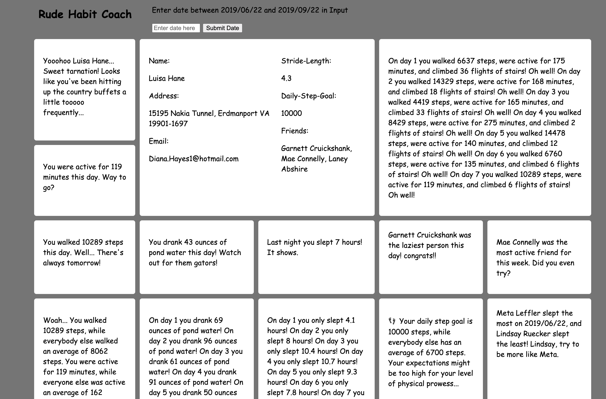

# FitLit, A Mod2 FE Paired Project

A Project by Chadrick Dickerson & Ian Holladay

## Links

### A Link to the Project Outline can be Found Here

[this project spec](http://frontend.turing.io/projects/fitlit.html)

### A Link to the GH Repo can be Found Here

[this repo link](https://github.com/holladayian/Chadrick-Ian-fitlit)

### We can be Located on GitHub

@chadrick-d-dev

@holladayian

## Overview

* Follow the specification to make a working application
* Implement ES6 classes that communicate to each other as needed
* Write modular, reusable code that follows SRP (Single Responsibility Principle)
* Implement a robust testing suite using TDD
* Use object and array prototype methods to perform data manipulation
* Display information on the page while maintaining ability to test class properties and methods
* Create a data dashboard that is easy to use and displays information in a clear way

## Theme

Both partners have a well-meaning dark sense of humor. This project is not intended to cause offense, but to instead come from a comical approach. We hope you enjoy our Rude Habit Coach.

## Accessability

- Color scheme: Our app is monochromatic to accomadate for those with visual impairments regarding color
- Font: We used Comic Sans MS to accomadate to those who have trouble reading certain fonts
- We have used voice over to make sure of the accessability of our project, and made sure that the entire application is read in an organized fashion

## Visuals



## Install/Setup instructions

* Clone down this Repo
* CD into the project
* Run the command run ```open src/index.html``` in the terminal
* Use the Date Search Bar to select current start date for a week
* This will update the rest of the DOM with the respective values
